# Plotter
Matplotlib based framework to create plots

## Installation

Download plotter.py and place it, where you want to import it from.

## How it works

1) Create an arguments list with
    - A list for each subplot with
       * A list with arguments and keyword arguments to be passed to the method

2) Create a methods list with methods to be called for each subplot.
These methods will iterate over each subplot's arguments. Here you can call any method available for [matplotlib Axes class](https://matplotlib.org/stable/api/axes_api.html).

3) Pass in your arguments and methods list to ```plotter```. Calling ```plotter``` returns a [figure object](https://matplotlib.org/stable/api/figure_api.html#matplotlib.figure.Figure), so you can further customize your plot using it.

## Examples

[The steps described above](## How it works) are demonstrated in the following examples.

### Base example

- Import

```
from plotter import plotter

```


- Create a list of arguments belonging to your plot:
  
```
  args =[ #For each subplot open square brackets
          [#For each matplotlib method you want to call e.g. .plot(), open square brackets and pass in the data.
          [range(4)]
          ]             
        ]
```

- Create a list of matplotlib method you want to call:

```
  methods =['plot']
```

- Call plotter:
    * ```ncols``` defines the number of columns in your plot, i.e. number of subplots per row. By default it is ```2```.
    * ```show=1``` calls ```matplotlib.pyplot.show()``` a.k.a. ```plt.show()```.
    * if ```save_path``` is given as keyword argument, the plot will be saved to the provided path.
    * ```fig_title``` is the title of the plot.

```
plotter(args,methods,ncols=1,fig_title='Base example',show=1,save_path='./example_plots/base_example.png');
```

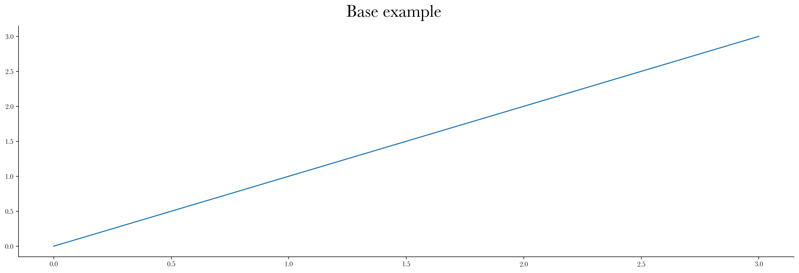

- To adjust things like color and linewidths, we pass in a dictionary. These are keyword arguments that the corresponding method (.plot() in this case) accepts:

```
keyword_args = dict(color='red',linewidth=5)

args =[
          [
          [range(4), keyword_args]
          ]             
        ]

plotter(args,methods,ncols=1,fig_title='Base example',show=1,save_path='./example_plots/base_example_keyword_args.png');
```

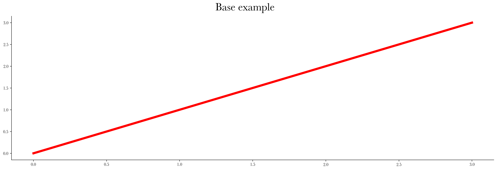

### Intermediate examples
```plotter``` does not really offer utility in simple cases. So we will gradually move on to more complicated ones. Let's say this time we want to have two subplots:

#### Two Line plots

```
import numpy as np

line_plot_data1 = np.random.rand(10)
line_plot_data2 = np.random.rand(10)

args =[ #For each subplot open square brackets
          [#First subplot
           [line_plot_data1,'g']
          ]
         ,[#Second subplot
           [line_plot_data2,'r']
          ]
      ]

methods =['plot']

plotter(args,methods,fig_title='Intermediate example',show=1,save_path='./example_plots/intermediate_example_2lineplots.png');
```
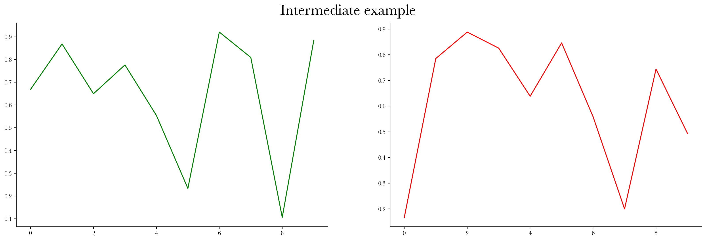

#### Line plot + Histogram

We want line plot in the first subplot and a histogram in the second subplot. To achieve this, we add 'hist' to our methods list. 

```
methods =['plot','hist']
```

Since the methods list iterate over each subplot's arguments list, it will expect data for a histogram, which we want to avoid. To skip it, we put ```None``` instead of a list of arguments to be passed to the method call.

```
hist_data1 = np.random.randn(1000)

args =[ #For each subplot open square brackets
          [
           [line_plot_data1,'g'],None
          ]
         ,[
           None,[hist_data1]
          ]
      ]

plotter(args,methods,fig_title='Intermediate example',show=1,save_path='./example_plots/intermediate_example_lineplot+hist.png');      

```

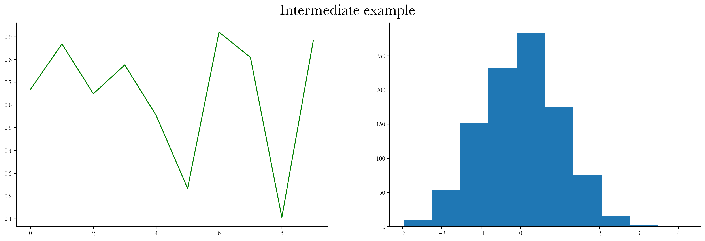

If we wanted a histogram and a line plot in each subplot:

```
hist_data2 = np.random.randn(1000)
line_plot_data1*=200
line_plot_data2*=200

args =[ #For each subplot open square brackets
          [
           [line_plot_data1,'g'],[hist_data1,dict(color='g',alpha=0.8)]
          ]
         ,[
           [line_plot_data2,'r'],[hist_data2,dict(color='r',alpha=0.8)]
          ]
      ]

plotter(args,methods,fig_title='Intermediate example',show=1,save_path='./example_plots/intermediate_example_lineplot&hist.png');
```

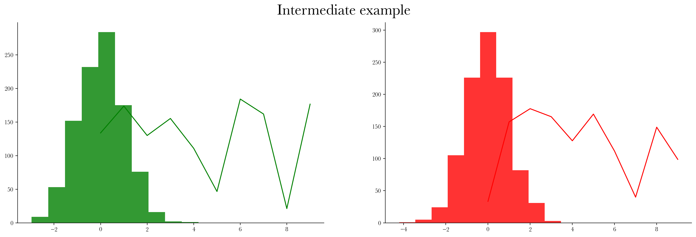

#### Tables

Tables are often useful when plotting histograms. Let's also add some axis labels:

```
mean1 = round(hist_data1.mean(),2)
mean2 = round(hist_data2.mean(),2)
std1 = round(hist_data1.std(),2)
std2 = round(hist_data2.std(),2)

args =[ #For each subplot open square brackets
          [
           [line_plot_data1,'g'],[hist_data1,dict(zorder=0,color='g',alpha=0.8)] \
              ,[dict(cellText=[[mean1],[std1]], rowLabels=[r"$\mu$",r"$\sigma$"],loc='upper right'),{'row_scale':2,'col_scale':0.1,'fontsize':20,"zorder":10,"alpha":0.1}]
          ]
         ,[
           [line_plot_data2,'r'],[hist_data2,dict(zorder=0,color='r',alpha=0.8)] \
          ,[dict(cellText=[[mean1],[std1]], rowLabels=[r"$\mu$",r"$\sigma$"],loc='upper right'),{'row_scale':2,'col_scale':0.1,'fontsize':20,"zorder":10,"alpha":0.1}]
          ,['Random x-label'],['Random y-label']
          ]
      ]


methods =['plot','hist',
          'make_table',
          'set_xlabel','set_ylabel']

plotter(args,methods,fig_title='Intermediate example',show=1,save_path='./example_plots/intermediate_example_lineplot&histtable.png');

```
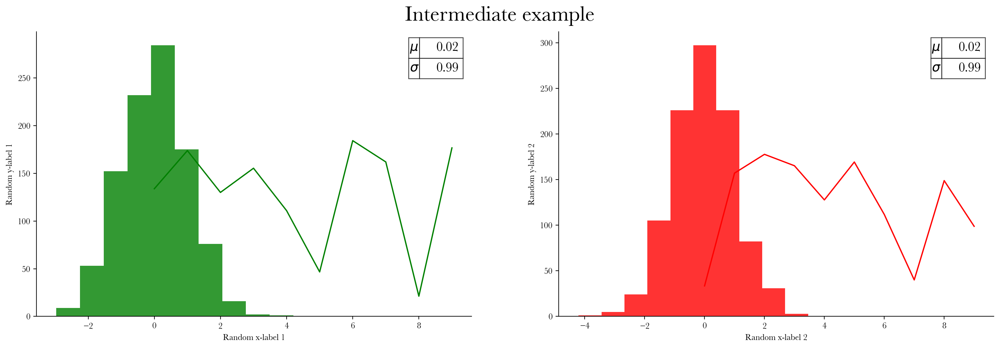

It would be better if the lineplots had their own x-axes but share the y-axis with the histograms. We use ```make_twiny```. Instead of a list, we pass a dictionary with methods we want to call as keys and their corresponding arguments as values:

```


args =[ 
          [
             [hist_data1,dict(zorder=0,color='g',label='histogram1',alpha=0.8)],[dict(axis='both',colors='g')],dict(color='green') \
            ,{'plot':[line_plot_data1,dict(label='lineplot1',color='r')],
                      'set_xlabel':['Random Twin x-label',dict(color='red')],
                              'color_ax':dict(color='r'),
                                      'tick_params':[dict(axis='x',colors='r')]
                                            ,'legend':[dict(loc='upper left')]}
            ,['Random x-label 1',dict(color='g')],['Random y-label 1',dict(color='g')],[]
          ]
      ]


methods =['hist','tick_params','color_ax',
          'make_twiny',
          'set_xlabel','set_ylabel','legend']

plotter(args,methods,fig_title='Intermediate example',ncols=1,show=1,suptitle_y=1.05,save_path='./example_plots/intermediate_example_lineplot&hist_twiny1.png');


```
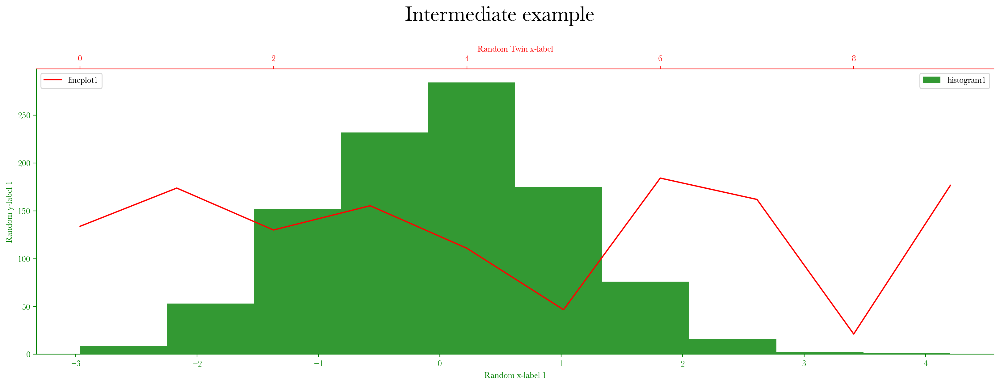

And if you do not want separate legends, just remove it from the dictionary:

```

args =[ 
          [
             [hist_data1,dict(zorder=0,color='g',label='histogram1',alpha=0.8)],[dict(axis='both',colors='g')],dict(color='green') \
            ,{'plot':[line_plot_data1,dict(label='lineplot1',color='r')],
                      'set_xlabel':['Random Twin x-label',dict(color='red')],
                              'color_ax':dict(color='r'),
                                      'tick_params':[dict(axis='x',colors='r')]}
            ,['Random x-label 1',dict(color='g')],['Random y-label 1',dict(color='g')],[]
          ]
      ]

plotter(args,methods,fig_title='Intermediate example',ncols=1,show=1,suptitle_y=1.05,save_path='./example_plots/intermediate_example_lineplot&hist_twiny2.png');

```


#### Two independent graphs in one subplot

To do this, we only need to write ```2nd_``` at the beginning of the method name. Rest is the same as what we would pass in for a primary graph. <b> Make sure to pass in </b>```second_plot=1``` <b> to plotter function. </b>

```
exp = np.exp(np.arange(0,10,0.01))
sin = np.sin(np.arange(0,10,0.01))

args =[ #For each subplot open square brackets
          [#For each matplotlib method you want to call e.g. .plot(), open square brackets and pass in the data.
          [exp,dict(label='exp',color='b')],[sin,dict(label='sin',color='r')]
         ,dict(color='b'),dict(color='r')
         ,[dict(axis='both',colors='b')],[dict(axis='both',colors='r')]
         ,['Random x-label1',dict(color='b')],['Random y-label1',dict(color='b')],['Random x-label2',dict(color='r')],['Random y-label2',dict(color='r')]
         ,[]
          ]             
        ]

methods =['plot','2nd_plot'
          ,'color_ax','2nd_color_ax'
          ,'tick_params','2nd_tick_params'
          ,'set_xlabel','set_ylabel','2nd_set_xlabel','2nd_set_ylabel'
          ,'legend']

plotter(args,methods,ncols=1,second_plot=1,suptitle_y=1.05,fig_title='Intermediate example',show=1,save_path='./example_plots/intermediate_example_twoindep.png');
```

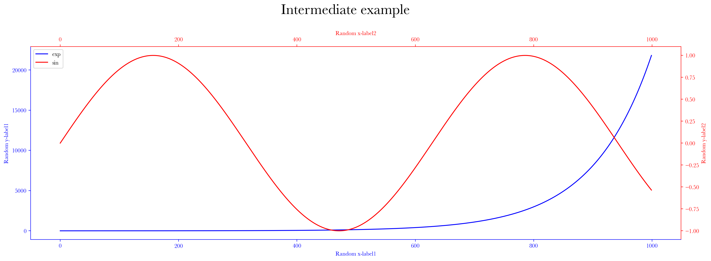

### Advanced examples

#### Ex1

```
import pandas as pd
errors_df = pd.read_pickle("./errors_df.pkl").loc['60']
errors_df_rounded = pd.read_pickle("./errors_df_rounded.pkl").loc['60']
model_names = [' '*i+k+' '*i for i in range(3) for k in ['NN','LinReg']]

data_1_mse = errors_df[('mid price','val')].loc['MSE'].values
data_1_mse_rounded = errors_df_rounded[('mid price','val')].loc['MSE'].values.tolist()

data_1_mape = errors_df[('mid price','val')].loc['MAPE (%)'].values
data_1_mape_rounded = errors_df_rounded[('mid price','val')].loc['MSE'].values.tolist()

data_2_mse = errors_df[('bid price variance','val')].loc['MSE'].values
data_2_mse_rounded = errors_df_rounded[('bid price variance','val')].loc['MSE'].values.tolist()

data_2_mape = errors_df[('bid price variance','val')].loc['MAPE (%)'].values
data_2_mape_rounded = errors_df_rounded[('bid price variance','val')].loc['MAPE (%)'].values.tolist()

args = [ #FIRST AXIS
        [ [model_names,data_1_mse,'X',dict(color='blue',label='MSE',markersize=15,alpha=0.5)]
         ,[data_1_mse,[*range(len(model_names))],[-1]*len(model_names),'blue','dashed',dict(linewidth=0.4)]
         ,[-0.5,len(model_names)-0.5],None#[0,0.26]
         ,{'plot':[model_names,data_1_mape,'o',dict(color='limegreen',label='MAPE',markersize=20,mfc='None')],'hlines':[data_1_mape,[*range(len(model_names))],len(model_names),'green','dashed',dict(linewidth=0.4)],'set_ylabel':[dict(ylabel='MAPE (%)',fontsize=15,rotation=-90,labelpad=18)],'tick_params':[dict(axis='both',labelsize=12)]}
         ,[dict(axis='both',labelsize=12)]
         ,['',dict(fontsize=15)], ['MSE',dict(fontsize=15)], ['Mid Price',dict(fontsize=20)]
         ,[dict(cellText=[data_1_mse_rounded,data_1_mape_rounded],rowLabels=['MSE','MAPE (%)'],cellLoc='center',bbox=[0, -0.22, 1, 0.1])]
         ,[dict(cellText=[['Trained with '+i for i in ('LOB', 'LIQ','LOB+LIQ')]],cellLoc='center',colLabels=['']*3,edges='vertical',bbox=[0, -0.12, 1, 0.12]),{'text_props':dict(set_color=['red'])}] #hor,ver,hor_size,ver_size
         ,[dict(ncol=1,shadow=1,labelspacing=0.3,fontsize=15,loc='upper left')],[dict(b=True,axis='x',alpha=0.5)]
        ]
        ,#SECOND AXIS
        [ [model_names,data_2_mse,'X',dict(color='blue',label='MSE',markersize=15,alpha=0.5)]
         ,[data_2_mse,[*range(len(model_names))],[-1]*len(model_names),'blue','dashed',dict(linewidth=0.4)]
         ,[-0.5,len(model_names)-0.5],None#[0,0.26]
         ,{'plot':[model_names,data_2_mape,'o',dict(color='limegreen',label='MAPE',markersize=20,mfc='None')],'hlines':[data_2_mape,[*range(len(model_names))],len(model_names),'green','dashed',dict(linewidth=0.4)],'set_ylabel':[dict(ylabel='MAPE (%)',fontsize=15,rotation=-90,labelpad=18)],'tick_params':[dict(axis='both',labelsize=12)]}
         ,[dict(axis='both',labelsize=12)]
         ,['',dict(fontsize=15)], ['MSE',dict(fontsize=15)], ['Bid Price Variance',dict(fontsize=20)]
         ,[dict(cellText=[data_2_mse_rounded,data_2_mape_rounded],rowLabels=['MSE','MAPE (%)'],cellLoc='center',bbox=[0, -0.22, 1, 0.1])]
         ,[dict(cellText=[['Trained with '+i for i in ('LOB', 'LIQ','LOB+LIQ')]],cellLoc='center',colLabels=['']*3,edges='vertical',bbox=[0, -0.12, 1, 0.12]),{'text_props':dict(set_color=['red'])}] #hor,ver,hor_size,ver_size
         ,[dict(ncol=1,shadow=1,labelspacing=0.3,fontsize=15,loc='upper left')],[dict(b=True,axis='x',alpha=0.5)]
        ]
       ]
attrs = ['plot'
         ,'hlines'
         ,'set_xlim','set_ylim'
         ,'make_twinx'
         ,'tick_params'
         ,'set_xlabel','set_ylabel','set_title'
         ,'make_table'
         ,'make_table'
         ,'legend','grid']

plotter(args,attrs,fig_title='Validation Performance of Models',dpi=300, ncols=1,xpad=-10,ypad=2,hspace = 0.32,suptitle_y=0.98,save_path='./example_plots/advanced_example_valmodels.png',show=1);

```

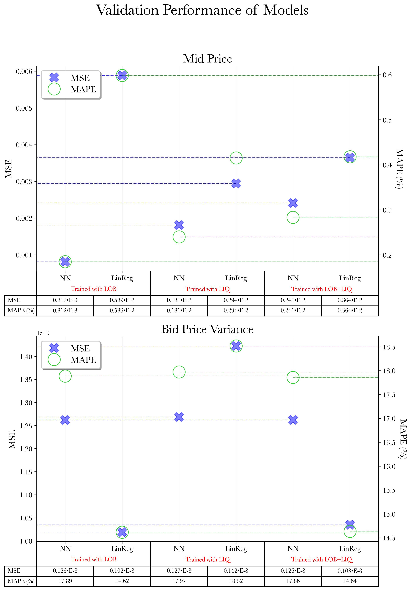

#### Ex2

```

def my_acf(x,lag,step):
    assert isinstance(x,np.ndarray),'Please give numpy array'
    x = (x - x.mean())/ np.sqrt(np.var(x))
    return np.array([1]+[(x[:-i]*x[i:]).mean() for i in range(step,lag,step)])

def get_xlim(errors_h,errors,tol):
    for i,k in enumerate(np.where(errors_h>tol*errors_h.max(),errors_h,0)[::-1]):
        if k != 0:
            return errors[len(errors)-i-1]
        
def get_axis_args(data_type,observable,bins,xlim_tol,maxlags,**kwargs):
    
    obs_dict = {'Mid Price':0,'Bid Price Expectation':1,'Ask Price Expectation':2,'Bid Price Variance':3,'Ask Price Variance':4}
    n = obs_dict[observable]
    data_type_dict = {'LOB':'a) ','LIQ':'b) ','LOB+LIQ':'c) '}
    
    acorr_step = kwargs.get('acorr_step',1)
    acorr_start = 1 #acorr_step in kac kati
    pf = 1
    ps = 6
    lw=1
    maxlags += 1 #!!!!!
    
    with open('./errors/' + f'{data_type}.npy', 'rb') as input:
        nn_errors = np.load(input,allow_pickle='TRUE').item()
        
    with open('./errors/' + f'LinReg_{data_type}.npy', 'rb') as input:
        linreg_errors = np.load(input,allow_pickle='TRUE').item()
        
    data_type=data_type.split('_')[0]

    se_train = nn_errors['se_train'][:,n]           ; se_train /= se_train.mean()
    se_train_reg = linreg_errors['se_train'][:,n]   ; se_train_reg /= se_train_reg.mean()
    se_val = nn_errors['se_val'][:,n]               ; se_val /= se_val.mean()
    se_val_reg = linreg_errors['se_val'][:,n]       ; se_val_reg /= se_val_reg.mean()
    ape_train = nn_errors['ape_train'][:,n]         ; ape_train /= ape_train.mean()
    ape_train_reg = linreg_errors['ape_train'][:,n] ; ape_train_reg /= ape_train_reg.mean()
    ape_val = nn_errors['ape_val'][:,n]             ; ape_val /= ape_val.mean()
    ape_val_reg = linreg_errors['ape_val'][:,n]     ; ape_val_reg /= ape_val_reg.mean()

    train_h , train= np.histogram(se_train,bins)              ; train = train[:-1] * 100         ; train_h = train_h/train_h.sum() * 100
    train_h_reg , train_reg = np.histogram(se_train_reg,bins) ; train_reg = train_reg[:-1] * 100 ; train_h_reg = train_h_reg/train_h_reg.sum() * 100
    val_h , val= np.histogram(se_val,bins)                    ; val = val[:-1] * 100             ; val_h = val_h/val_h.sum() * 100
    val_h_reg , val_reg = np.histogram(se_val_reg,bins)       ; val_reg = val_reg[:-1] * 100     ; val_h_reg = val_h_reg/val_h_reg.sum() * 100

    train_h_ape , train_ape= np.histogram(ape_train,bins)              ; train_ape = train_ape[:-1] * 100         ; train_h_ape = train_h_ape/train_h_ape.sum() * 100
    train_h_reg_ape , train_reg_ape = np.histogram(ape_train_reg,bins) ; train_reg_ape = train_reg_ape[:-1] * 100 ; train_h_reg_ape = train_h_reg_ape/train_h_reg_ape.sum() * 100
    val_h_ape , val_ape = np.histogram(ape_val,bins)                   ; val_ape = val_ape[:-1] * 100             ; val_h_ape = val_h_ape/val_h_ape.sum() * 100
    val_h_reg_ape , val_reg_ape = np.histogram(ape_val_reg,bins)       ; val_reg_ape = val_reg_ape[:-1] * 100     ; val_h_reg_ape = val_h_reg_ape/val_h_reg_ape.sum() * 100

    xlim= max([get_xlim(i,k,xlim_tol) for i,k in zip([train_h,train_h_reg,val_h,val_h_reg,train_h_ape,train_h_reg_ape,val_h_ape,val_h_reg_ape],[train,train_reg,val,val_reg,train_ape,train_reg_ape,val_ape,val_reg_ape])])
    
    ac_se_train = my_acf(se_train,maxlags,acorr_step)[acorr_start:]   ; ac_se_train_reg = my_acf(se_train_reg,maxlags,acorr_step)[acorr_start:]
    ac_ape_train = my_acf(ape_train,maxlags,acorr_step)[acorr_start:]  ; ac_ape_train_reg = my_acf(ape_train_reg,maxlags,acorr_step)[acorr_start:] 
    ac_se_val = my_acf(se_val,maxlags,acorr_step)[acorr_start:]        ; ac_se_val_reg = my_acf(se_val_reg,maxlags,acorr_step)[acorr_start:]
    ac_ape_val = my_acf(ape_val,maxlags,acorr_step)[acorr_start:]      ; ac_ape_val_reg = my_acf(ape_val_reg,maxlags,acorr_step) [acorr_start:]
    
    acorr_range = [*range(acorr_start*acorr_step, maxlags,acorr_step)] 
    acorr_range_neg = [*range(-acorr_start*acorr_step, -maxlags,-acorr_step)] 
    
    ylim_2nd = max(ac_se_train.max(),ac_ape_train.max(),ac_se_val.max(),ac_ape_val.max(),ac_se_train_reg.max(),ac_ape_train_reg.max(),ac_se_val_reg.max(),ac_ape_val_reg.max())
    ylim_2nd = round(ylim_2nd,2)
    ylim_2nd += 0.2
    axis_args = [
            [ 
              [-train,train_h,-np.diff(train)[0],dict(align='edge',color='blue',alpha=0.8)]              ,[val,val_h,np.diff(val)[0],dict(align='edge',color='tomato',alpha=0.8)]              ,[-train_reg,train_h_reg,-np.diff(train_reg)[0],dict(align='edge',color='gold',alpha=0.8)]               ,[val_reg,val_h_reg,np.diff(val_reg)[0],dict(align='edge',color='limegreen',alpha=0.8)]
             ,[-train_ape,-train_h_ape,-np.diff(train_ape)[0],dict(align='edge',color='blue',alpha=0.4)] ,[val_ape,-val_h_ape,np.diff(val_ape)[0],dict(align='edge',color='tomato',alpha=0.4)] ,[-train_reg_ape,-train_h_reg_ape,-np.diff(train_reg_ape)[0],dict(align='edge',color='gold',alpha=0.4)]  ,[val_reg_ape,-val_h_reg_ape,np.diff(val_reg_ape)[0],dict(align='edge',color='limegreen',alpha=0.4)]
             ,[[],dict(marker='o',color='blue',linewidth=2,alpha=0.5,ls='none',fillstyle='left')]                         ,[[],dict(marker='o',color='tomato',linewidth=2,alpha=0.5,ls='none',fillstyle='right')]                ,[[],dict(marker='o',color='gold',linewidth=2,alpha=0.5,ls='none',fillstyle='left')]                                      ,[[],dict(marker='o',color='limegreen',linewidth=2,alpha=0.5,ls='none',fillstyle='right')]
             \
             ,[acorr_range_neg[::pf],ac_se_train[::pf]  ,'o',dict(color='blue',markersize=ps)]               ,[acorr_range[::pf],ac_se_val[::pf]  ,'o',dict(color='crimson',markersize=ps)]                ,[acorr_range_neg[::pf],ac_se_train_reg[::pf]  ,'o',dict(color='gold',markersize=ps,mfc='None')]               ,[acorr_range[::pf],ac_se_val_reg[::pf]  ,'o',dict(color='limegreen',markersize=ps,mfc='None')]
             ,[acorr_range_neg,0,ac_se_train              ,'blue','solid',dict(alpha=0.5,linewidth=lw)]    ,[acorr_range,0,ac_se_val              ,'crimson','solid',dict(alpha=0.5,linewidth=lw)]     ,[acorr_range_neg,0,ac_se_train_reg              ,'gold','solid',dict(alpha=1,linewidth=lw)]            ,[acorr_range,0,ac_se_val_reg             ,'limegreen','solid',dict(alpha=1,linewidth=lw)]
             ,[acorr_range_neg[::pf],-ac_ape_train[::pf],'D',dict(color='blue',markersize=ps)]               ,[acorr_range[::pf],-ac_ape_val[::pf],'D',dict(color='crimson',markersize=ps)]                ,[acorr_range_neg[::pf],-ac_ape_train_reg[::pf],'D',dict(color='gold',markersize=ps,mfc='None')]               ,[acorr_range[::pf],-ac_ape_val_reg[::pf],'D',dict(color='limegreen',markersize=ps,mfc='None')]
             ,[acorr_range_neg,0,-ac_ape_train            ,'blue','dashed',dict(alpha=0.5,linewidth=lw)]   ,[acorr_range,0,-ac_ape_val            ,'crimson','dashed',dict(alpha=0.5,linewidth=lw)]    ,[acorr_range_neg,0,-ac_ape_train_reg           ,'gold','dashed',dict(alpha=1,linewidth=lw)]           ,[acorr_range,0,-ac_ape_val_reg          ,'limegreen','dashed',dict(alpha=1,linewidth=lw)]
             ,[[],dict(marker='o',color='black',ls='solid',fillstyle='none')],[[],dict(marker='D',color='black',ls='dashed',fillstyle='none')]
             \
             ,[-xlim,xlim],[-ylim_2nd,ylim_2nd]
             ,[dict(color='chocolate', lw=1)],[dict(color='chocolate', lw=1)],[dict(color='magenta', lw=0.8)]
             ,[acorr_range_neg[::2]+acorr_range[::2]]
             ,dict(x='positive',y='positive'),dict(x='positive',y='positive')
             ,['Errors Relative to the Mean (%)',dict(fontsize=15,color='sienna')],['Normalized Error Counts (%)',dict(fontsize=15,color='sienna')],[data_type_dict[data_type]+data_type,dict(fontsize=20,pad=60)]
             ,['Time Lag in Minutes',dict(fontsize=15,color='darkmagenta',labelpad=5)],[r'Autocorr. Coeff. Magnitude',dict(fontsize=15,rotation=-90,color='darkmagenta',labelpad=15)]
             ,[[-0.06, 1, 'Squared Errors'],dict(fontsize=20,rotation=90,horizontalalignment='right',verticalalignment='top')],[[-0.06, 0, 'Relative Errors'],dict(fontsize=20,rotation=90,horizontalalignment='right',verticalalignment='bottom')],[[0.01, -0.05, 'Training Side'],dict(color='black',fontsize=20,horizontalalignment='left',verticalalignment='top')],[[0.99, -0.05, 'Validation Side'],dict(color='black',fontsize=20,horizontalalignment='right',verticalalignment='top')]
             ,[[1.08, 0.72, r'$(\circ,\plus) ; (\diamond,\minus)$'],dict(color='darkmagenta',fontsize=20,horizontalalignment='right',verticalalignment='bottom',rotation=-90)],[[1.08, 0.28, r'$(\circ,\minus) ; (\diamond,\plus)$'],dict(color='darkmagenta',fontsize=20,horizontalalignment='right',verticalalignment='top',rotation=-90)]
             ,[[0.5, 1.2, kwargs.get('ax_suptitle','')],dict(color='black',fontsize=25,horizontalalignment='center',verticalalignment='bottom')]
             ,dict(color='sienna'),dict(color='darkmagenta'),[dict(axis='x',colors='darkmagenta',rotation=90,direction='in')],[dict(axis='y',colors='darkmagenta',direction='in')],[dict(axis='x',colors='sienna',direction='in')],[dict(axis='y',colors='sienna',direction='in')]
             ,[dict(line_order = [[0, 1], [2, 3],[4],[5]],labels=['NN','LinReg','Squared Err. Autocorr.','Rel. Err. Autocorr.'] ,ncol=2,shadow=1,columnspacing=0.5,labelspacing=1,fontsize=12,loc='upper right')],[dict(b=True,axis='both',alpha=0.5)]
            ]
           ]
    
    return axis_args


args = []
window_size=20
for obs in ['Mid Price','Bid Price Expectation','Ask Price Expectation','Bid Price Variance','Ask Price Variance']:#
    for i,data_type in enumerate([f'LOB_{window_size}',f'LIQ_{window_size}',f'LOB+LIQ_{window_size}']):#
        args += get_axis_args(data_type,obs,'fd',0.1,maxlags=18000,acorr_step=1000,ax_suptitle=obs*int(i%3==1))


attrs = [
          'bar','bar','bar','bar'
         ,'bar','bar','bar','bar'
         ,'plot','plot','plot','plot'#just for legend
         \
         ,'2nd_plot','2nd_plot','2nd_plot','2nd_plot' #yuvarlak
         ,'2nd_vlines','2nd_vlines','2nd_vlines','2nd_vlines' #yuvarlagin cizgisi
         ,'2nd_plot','2nd_plot','2nd_plot','2nd_plot' #diamond
         ,'2nd_vlines','2nd_vlines','2nd_vlines','2nd_vlines' #diamond cizgisi
         ,'plot','plot'#just for legend
         \
         ,'set_xlim','2nd_set_ylim'
         ,'axvline','axhline','2nd_axhline'
         ,'2nd_set_xticks'
         ,'ticks','2nd_ticks'
         ,'set_xlabel','set_ylabel','set_title'
         ,'2nd_set_xlabel','2nd_set_ylabel'
         ,'text','text','text','text'
         ,'text','text'
         ,'text' # baslik icin
         ,'color_ax','2nd_color_ax','2nd_tick_params','2nd_tick_params','tick_params','tick_params'
         ,'legend','grid'
        ]

fig = plotter(args,attrs,second_plot=1,fig_title=f'Distributions and Autocorrelation of Errors\n Window Size: {window_size}' \
              ,dpi=300, ncols=3,xpad=10,ypad=25, hspace = 0.45 ,suptitle_y=0.95,suptitle_x=0.51,save_path='./example_plots/advanced_example_autcorr.png',show=1)
```


## Other Features

### Axes Related

#### Thicker and centered axes

Here we look at some axes related features that can be passed in to ```plotter``` as keyword arguments:
- ```axes_linewidth```: Set the linewidth of axes. Default is ```1```.
- ```keep_spines```: Set to ```True``` to keep the top and right sides of the figure's frame, which are removed by default.
- ```centered_x_axis``` and ```centered_y_axis```: Set each to ```True``` to have centered x- and/or y-axes.

```
args =[ 
          [
          [range(4)],[dict(width=4,direction='inout',length=8)]
          ]             
        ]

methods =['plot','tick_params']

plotter(args,methods,ncols=1,fig_title='Base example',show=1,axes_linewidth=4,keep_spines=True,save_path='./example_plots/axes_stuff.png');

plotter(args,methods,ncols=1,fig_title='Base example',show=1,axes_linewidth=4,centered_x_axis=True,centered_y_axis=True,save_path='./example_plots/axes_stuff.png');

```


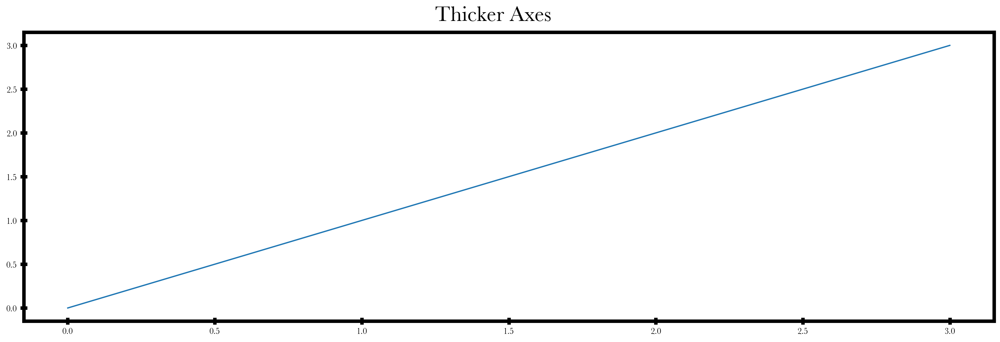
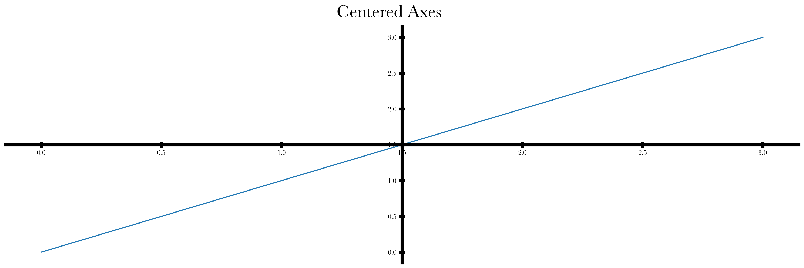

#### Inset axes

To create an inset plot, we use ```inset_axes``` method and pass in a dictionary with the following keys as argument:

- ```bounds``` : Lower-left corner of inset Axes, and its width and height.
- ```methods``` : Methods to be called for the inset Axes.
- ```args``` : Arguments to be passed in to ```methods```.

Other (keyword) arguments will be passed in as usual to [```inset_axes```](https://matplotlib.org/stable/api/_as_gen/matplotlib.axes.Axes.inset_axes.html).

```
vlines = [(3,6,7.5),0.,1.] # vline_x_positions, vline_y_min , vline_y_max
hlines = [(0.5,1,0),(3,7,7),(6,8,8)] # hline_y_positions, hline_x_mins , hline_x_maxes
inset_bounds = [.6,0.2,.2,.5] # x0,y0,xwidth,ywidth
indicator_bounds = [2.5,-0.125,6,1.25] # x0, y0, width, height
connector_lines = [False,False,True,True] #lower_left, upper_left, lower_right upper_right

methods =['vlines','hlines',
          'inset_axes','indicate_inset',
          'set_xlim'
          ]

args =[
          [
          vlines,hlines
          ,dict(bounds=inset_bounds,methods=['vlines','hlines','color_ax'],args=[[vlines,hlines,dict(color='magenta')]]),[dict(bounds=indicator_bounds,edgecolor='magenta',connector_lines=connector_lines)]
          ,[0,20]
          ]
        ]


fig=plotter(args,methods,ncols=1,fig_title='Inset Axes',show=1,keep_spines=True,save_path='./example_plots/inset_axes.png');
```

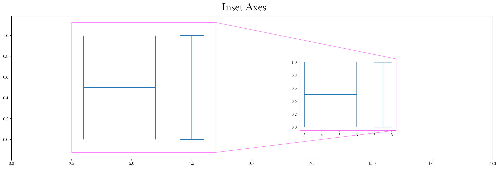

### Spacing & Padding

To give space between subplots [```hspace``` and ```wspace``` can be used](https://matplotlib.org/stable/api/_as_gen/matplotlib.pyplot.subplots_adjust.html).

```
args =[ 
          [
          [range(4)]
          ]             
        ]

methods =['plot']

plotter(4*args,methods,fig_title='Height Space',keep_spines=1,show=1,hspace=2,save_path='./example_plots/hspace.png');
```

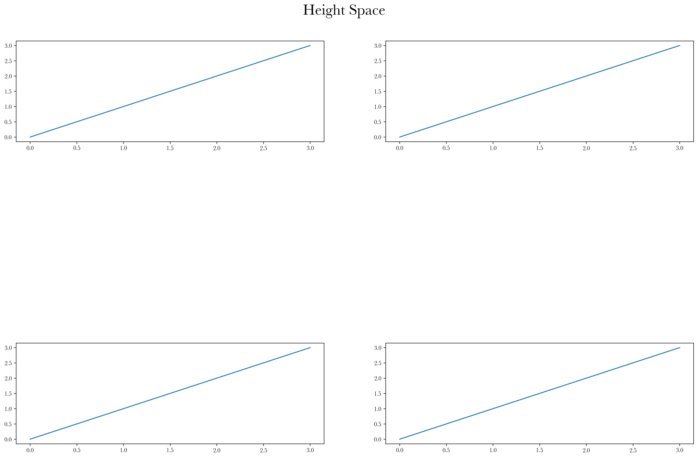

To strech the subplots in y- and/or x-direction, use ```ypad``` and/or ```xpad```:

```
plotter(4*args,methods,fig_title='Y-Pad',keep_spines=1,show=1,ypad=12,save_path='./example_plots/ypad.png');
```

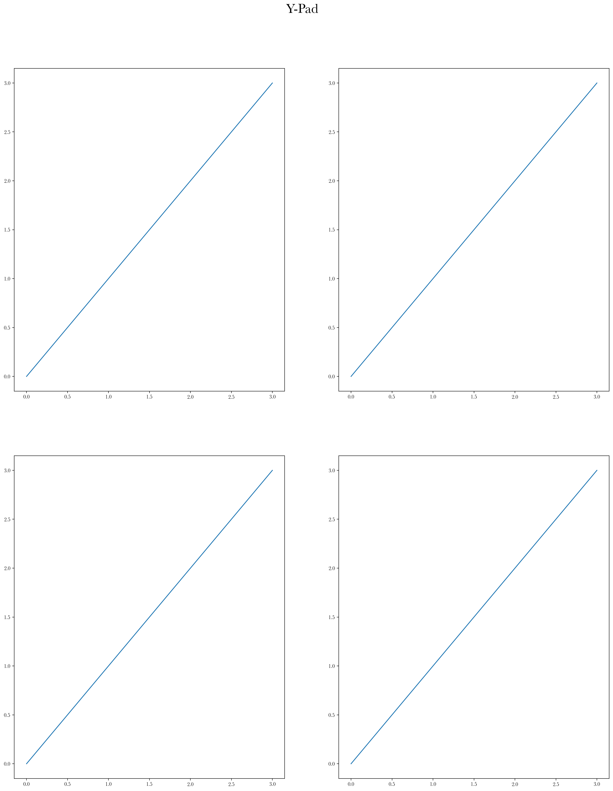
